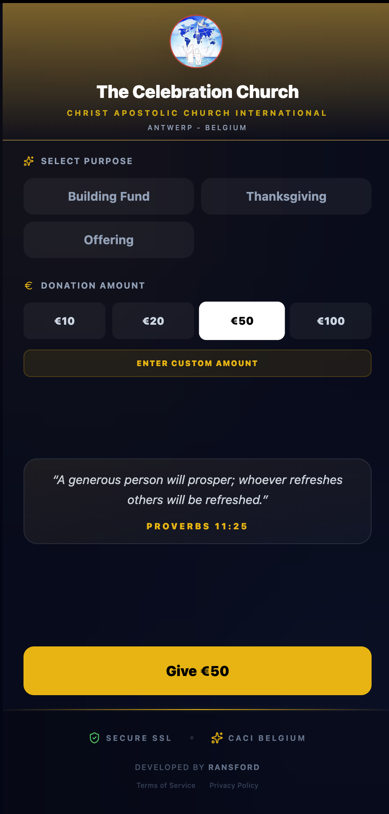
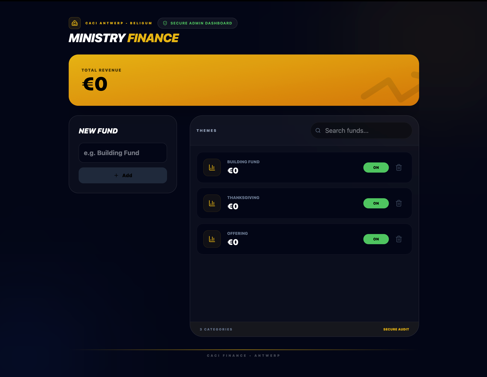

# Church Donation Platform

  
  
  

---

## Overview

The **Church Donation Platform** is a full-stack donation management system designed for churches to:

- Accept secure donations online.  
- Track contributions per donation purpose.  
- Allow admins to manage donation purposes and view total revenue.  

It is built with **React + TypeScript** for the frontend, **Stripe** for payments, and a modular backend API.

---

## Client / Use Case

This platform was specifically developed for **Christ Apostolic Church International (Belgium)**, addressing real-world needs such as:

- Managing multiple donation categories  
- Providing a seamless and secure giving experience for members  
- Enabling transparent financial tracking for administrators  
- Supporting both predefined and custom donation purposes  

---

## Screenshots

### Contributions Page

  
*Users can select contribution purposes, choose or enter amounts, and make payments.*

### Admin Dashboard

  
*Admins can add, delete, and toggle donation purposes, and track total revenue.*

---

## Features

### Public User Features

- Select **predefined donation purposes** or **enter custom purposes**.  
- Choose **preset or custom amounts**.  
- Animated Bible verses during the donation process.  
- **Secure payments via Stripe PaymentIntent**.  
- Responsive design for **mobile and desktop**.  

### Admin Features

- Add, delete, and toggle donation purposes.  
- Track total revenue and individual purpose contributions.  
- Search and filter donation purposes.  
- Responsive **dashboard layout** with scrollable purpose list.  
- Visual status indicators for each purpose (active/inactive).  

### Technical Features

- **React + TypeScript** frontend with reusable components.  
- **Custom hooks**:  
  - `useAdminPurposes` – central hook for admin donation purpose management.  
  - `useCreatePurpose`, `useDeletePurpose`, `useTogglePurposeStatus`.  
- **React Query / TanStack Query** for async data fetching and mutations.  
- **Stripe Integration** with dynamic public key loading.  
- Environment configuration via `.env` or `env.yaml`.  
- **Vite** powered for fast development and HMR.  

